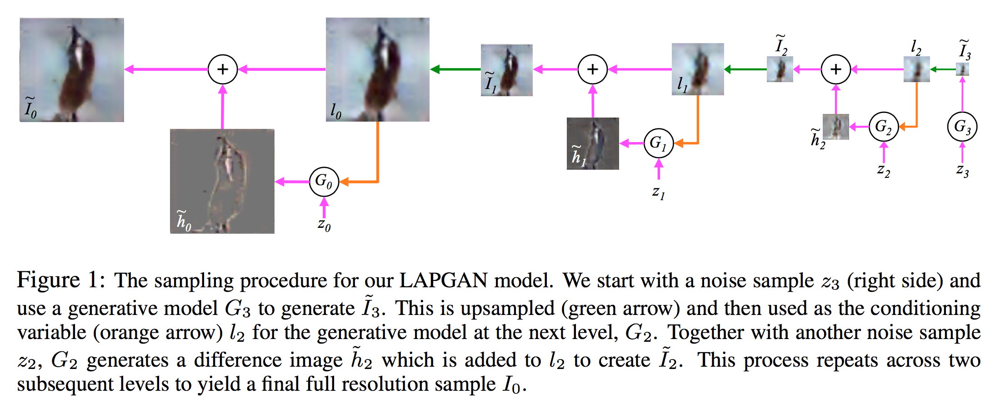
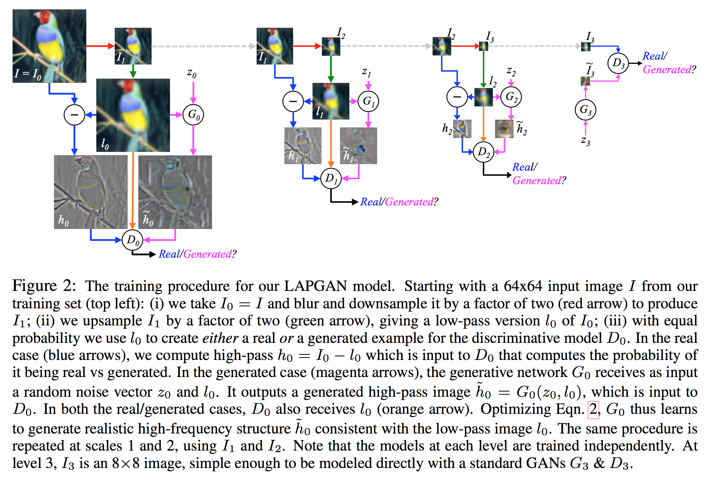

# Batch Normalization
## Paper
* Title: Deep Generative Image Models using a Laplacian Pyramid of Adversarial Networks
* Authors: Emily Denton, Soumith Chintala, Arthur Szlam, Rob Fergus
* Link: https://arxiv.org/abs/1506.05751
* Tags: Neural Network, Generative Adversarial Network, Laplacian Pyramid
* Year: 2015

## Abstract
この論文では自然画像の高品質なサンプルを生成する能力を持ったパラメトリック生成モデルを紹介する.このアプローチではcoarse-to-filneな方法で画像を生成するために、ラプラシアンピラミッドフレームワーク内で畳み込みニューラルネットワークのカスケードを使用する.ピラミッドのレベルごとに、独立した生成畳み込みネットワークがGANのアプローチを用いて訓練される.このモデルで描かれるサンプルは他の代替法よりも非常に高品質である。人間の評価者による定量評価では、CIFAR10から生成したサンプルは実際の画像と約40%間違われたが、GANをベースにしたモデルが描いたサンプルの場合は約10%だった.LSUNの風景データセットのより高解像度の画像で訓練したモデルによるサンプルも示す.

## Summary
### LAPGAN
ラプラシアンピラミッドの係数$h_k$をGANを利用して生成し、ラプラシアンピラミッドを利用して、低解像度の画像から高解像度の画像を生成する.
### ラプラシアンピラミッド
* $I$: 元画像.
* $d(\cdot)$: 入力画像に対してぼかしと縮小を行うダウンサンプリング演算.
* $u(\cdot)$: スムースと拡大を行うアップサンプリング演算.
* ガウシアンピラミッド: $\mathcal{G}(I)=[I_0, I_1, \cdots, I_K]\left(I_0=I, I_{k+1}=d(I_k)\right)$
* ラプラシアンピラミッド: $\mathcal{L}(I)=[h_0, h_1, \cdots, h_K]\left(h_K=I_K, h_k = I_k - u(I_{k+1})\right)$

### アルゴリズム
#### 生成
* 生成モデル郡: $\left\{G_0, \cdots, G_K\right\}$
* $z_k$: ノイズベクトル
1. ノイズ$z_K$から低解像度画像$\tilde{I}_K$を生成
  $$
  \tilde{h}_K = \tilde{I}_K = G_K(z_K)
  $$
2. ノイズ$z_k$と$I_k = u(\tilde{I}_{k+1})$から差分画像$\tilde{h}_k$を生成
  $$
  \tilde{h}_k = G_k(z_k, I_k))
  $$
3. $I_k$と$\tilde{h}_k$を足し合わせ$\tilde{I}_{k}$を作成
  $$
  \tilde{I}_{k} = I_k + \tilde{h}_k
  $$
4. 2~3を$k=0$になるまで繰り返す.

* Note: ノイズと入力の結合方法(concatenation)について
  - 方法は色々
  - 単純にベクトルを連結したり、新しいチャネルとして結合したり

#### 訓練
* 用語
  - 生成モデル郡: $\left\{G_0, \cdots, G_K\right\}$
  - $I_k = d(I_{k-1})$: 元となる画像
  - $l_k = u(d(I_k))$: 復元対象となる画像
  - $h_k = I_k - l_k $: 訓練サンプルとなる差分画像.
  - $\tilde{h}_k$: Generatorの生成画像.

* $k=K$のとき
  標準のGANと同じように訓練
* $k < K$のとき
  - Generator
    $l_k$と$z_k$を入力として$\tilde{h}_k$を生成.$\tilde{h}_k$と$h_k$をDiscriminatorに入力し、出力が全て真となるよう学習.
  - Discriminator
    Generatorは固定したまま、$\tilde{h}_k$と$h_k$を分類できるように学習

* Note: それぞれのGANを独立に学習することに注意

## ノート
### 1 Introduction
* (1.1) Related Work
### 2 Approach
* (2.1) Generative Adversarial Nets
  - [GAN](https://arxiv.org/abs/1406.2661)について
  - [CGAN](https://arxiv.org/abs/1411.1784)について
* (2.2) Laplacian Pyramid
  - [Laplacian Pyramid](http://ieeexplore.ieee.org/abstract/document/1095851/?reload=true)

  - バンドパス画像の集合で構成された線形可逆画像表現
  - $d(\cdot)$: ダウンサンプリング演算.ぼかしと縮小.$j\times j$の画像$I$に対して$d(I)$は$j/2\times j/2$の大きさ.
  - $u(\cdot)$: アップサンプリング演算.スムースと拡大.$j\times j$の画像$I$に対して$u(I)$は$2j\times 2j$の大きさ.
  - ガウシアンピラミッド$\mathcal{G}(I) = [I_0, I_1, \cdots, I_K]$: $I_0=I$,$I_k$は$I$に対し、$k$回 $d(\cdot)$を適用したもの.$K$はピラミッドのレベル.
  - $h_k$: ラプラシアンピラミッド$L(I)$の各レベルに置ける係数.ガウシアンピラミッドのあるレベルの画像と、それより一つ小さい画像を$u(\cdot)$でアップサンプリングしたものの差分.
  $$
  h_k = \mathcal{L}_k(I) = \mathcal{G}_k(I) - u(\mathcal{G}_{k+1}(I)) = I_k - u(I_{k+1})
  $$
  直感的には各レベルで得られる画像は特定のスケールの構造を表している.$h_K$は差分画像ではなく$h_K=I_K$である低周波数画像を使う.
  ラプラシアンピラミッド係数$[h_1, h_2, \cdots, h_K]$から
  $$
  I_k = u(I_k+1) + h_k
  $$
  として再構成できる.つまり、低解像度から初めてアップサンプリングと差分画像$h$を加えることで最終的に完全な解像度まで戻すことができる.
* (2.3) Laplacian Generative Adversarial Networks (LAPGAN)
  - ラプラシアンピラミッドとGANを組み合わせたもの
  - 生成畳み込みモデル$\{G_0, \cdots, G_K\}$: ラプラシアンピラミッドの各レベルの自然画像の係数$h_k$の分布を捉えたもの
  - 生成畳み込みモデルを$h_k$を生成するために使用すると
    $$
    \tilde{I}_k = u(\tilde{I}_{k+1}) + \tilde{h}_k = u(\tilde{I}_{k+1}) + G_k{(z_k, u(\tilde{I}_{k+1}))}
    $$
    となる.
  - 再構成は$\tilde{I}_{K+1}=0$から始まり、$G_K$を用いて低周波画像$\tilde{I}_K$をノイズベクトル$z_K$を使用して$\tilde{I}_K=G(z_K)$として生成する.
  - $G_K$を除く全てのレベルのモデルは現在の画像$\tilde{I}_{k+1}$をアップサンプリングしたものを条件変数とし、そこにノイズベクトル$z_k$を加えたものを受け取るCGAN
  - ピラミッドの各レベルの生成モデル$\{G_0, \cdots, G_K\}$は$CGAN$のアプローチを用いて学習し、各訓練画像$I$からラプラシアンピラミッドを構成
  - 各レベルで係数$h_k$を標準的な生成方法で求めるか、$G_k$を用いて$\tilde{h}_k=G_k(z_k, u(I_{k+1}))$として求めるか確率的に選択する
  - $G_k$は$l_k=u(I_{k+1})$と$z_k$を同時に入力として使用する.
  - $D_k$は$h_k$または$\tilde{h}_k$と$l_k$を入力として受け取り入力
  が本物か偽物かを出力する.($l_k$は初めの畳み込み層の前に$h_k$または$\tilde{h}_k$を加えられたもの)
  - $k=K$のときは$\tilde{h}_K = G_K(z_K)$とし、標準的なGANのように学習する.
  - カスケードの出力と実際の画像の出力を識別するようネットワークを訓練していない。代わりに各ステップを妥当なものにすることに焦点を当てている
  - 各レベルで独立して訓練することはモデルが訓練データを記憶することを難しくさせるという利点がある(過学習を防ぐことに繋がる).
  - クラスラベルを使用した方法についても検討した.これはクラスを表す1-hot ベクトル$c$をもう一つの条件変数として$G_k$, $D_k$に加えることで行う

### 3 Model Architecture & Training
* (3.1) CIFAR10 and STL
  - CIFAR10: $32\times 32$ピクセルの10種類のクラスを持つカラー画像データセット.データ数は約100k.
  - STL: $96\times 96$ピクセルの10種類のクラスを持つカラー画像データセット.データ数は約100k.
  - 初期の画像は$8\times 8$.$G_K$, $D_K$共に二つの隠れ層を持ったパーセプトロン.活性化関数はReLU.$D_K$はDropOutを使用し、各層は600ユニットを持つ.$G_K$は1200ユニットを各層にもち、$z_K$は100次元ベクトル.
  - CIFAR10では$28\times 28$にクロップし、$8 \rightarrow 14 \rightarrow 28$として生成.
  - STLでは$8 \rightarrow 16 \rightarrow 32 \rightarrow 64 \rightarrow 96$として生成.
  - $G_k$と$D_k$は畳み込みで3層と2層.詳細は[ウェブサイト](http://soumith.ch/eyescream).$z_k$は4チャネル.
  - CIFAR10ではクラス条件付きのものも試した.ベクトル$c$は1つ目の層の層の特徴マップに結合される1つの特徴マップにリシェイプされる出力を持つ線形層を通して$G_k$,$D_k$に統合される.
  - 学習は学習係数の初期値が$0.02$でありエポック毎に$(1 + 4 \times 10 ^{-5})$分の1され、SGDを用いて行う.また、モメンタムは$0.5$から初め、各エポックで$0.008$増加し、最大$0.8$になる.
  - 訓練中に対数尤度をパルツェン窓を用いてカーネル密度推定を行い、最も良い状態を維持する
  - 訓練時間はモデルの大きさとピラミッドレベルに依存し、小さなモデルは数時間、大きなモデルは数日かけて訓練する

* (3.2) LSUN
  - LSUN: $64\times 64$にダウンサンプリングされた10種類の自然風景画像データセット.データ数は約10M.
  - 10種類それぞれでLAPGANモデルを作成.
  - $4 \rightarrow 8 \rightarrow 16 \rightarrow 32 \rightarrow 64$として生成.
  - $G_k$,$D_k$は各レベルで共通.
  - $G_k$は5層畳み込みネット.$\{64, 368, 128, 224\}$の特徴マップを持つ畳み込み層と線形出力層を持つ.フィルタは$7\times 7$,ReLU, batch normalization,Dropoutが各層に使用されている.
  - $D_k$は$\{48, 448, 416\}$の3層の畳み込み層にシグモイドの出力層がつく.
### 4 Experiments
- 評価方法は3つ
  1. 特定の画像郡の対数尤度の比較
  2. モデルに画像を生成させる
  3. 人間が生成した画像、元となった手法で生成した画像、実際の画像を比較

* (4.1) Evaluation of Log-Likelihood
  - 伝統的には特定のデータに対する対数尤度を求めることで生成モデルを求める.画像の確率を直接計算できない場合には、対数尤度を見積もるためにガウシアン・パルツェン窓を用いることをGoodfellowたちは提案している.(http://papers.nips.cc/paper/5423-generative-adversarial-nets)これは明確な密度関数がないモデルの対数尤度を見積もる最もよい方法.
  - LAPGANではマルチスケールの構造を利用して対数尤度を見積もる.この方法ではガウシアン・パルツェン窓を用いてラプラシアンピラミッドの各スケールの確率密度を求める.詳細は付録.
  - $32\times 32$のCIFAR10とSTLの画像郡の対数尤度を見積もる.パルツェン窓の大きさを制御する変数$\sigma$は検証用データセットを用いて選択し、CIFAR10,STLそれぞれで5000のサンプルを用いて対数尤度を求める.また、Goodfellowたちが提案した方法でも見積もる.
  - 両方のデータセットで対数尤度は非常に高いものとなった.別の手法と比較しても疑わしいもの.
* (4.2) Model Samples
  - 図3. CIFAR10の生成画像.
  - 図4. STLの生成画像.
  - 図5. LSUNの生成画像.
* (4.3) Human Evaluation of Samples
  - 15人のボランティアに生成画像が本物かどうか識別してもらった.
  - CIFAR10を使用して学習した3つのモデルからの生成画像と本物の画像の内からランダムに見せる
  - 50msから2000msを11分割し、ランダムに時間を決めて画像を見せ判断.
  - 実験前に例を見せている
  - 約1000サンプルを取得
### 5 Discussion
- 画像の構造に関してGANを修正することで他の畳み込み生成モデルより高品質の画像をシンプルな生成モデルを用いて生成する手法を提案
- 重要なことは、全体の整合性を諦め、生成を妥当な生成の連続に分解したこと
- 他のマルチスケールを持つシグナルモダリティも同様の手法の恩恵を受ける
